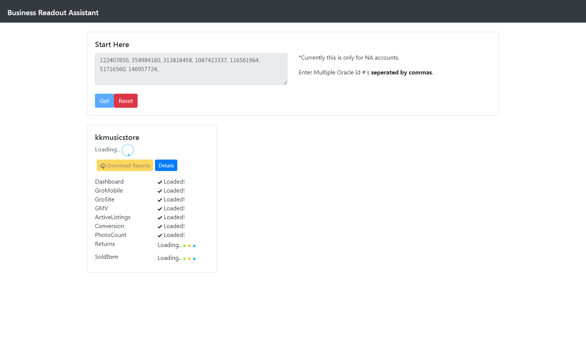
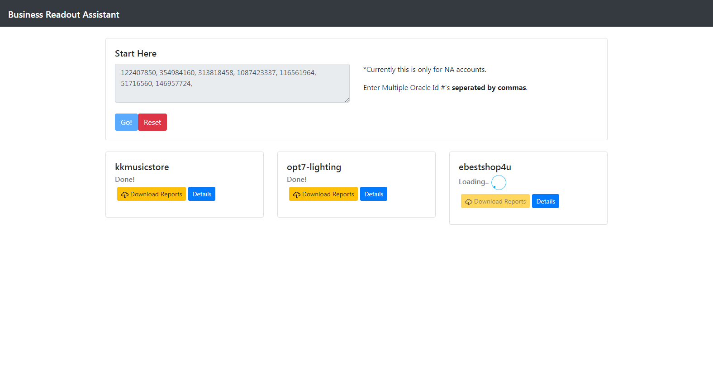
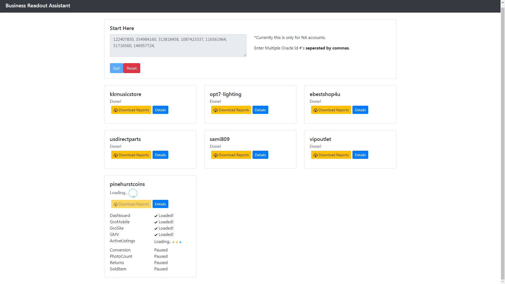
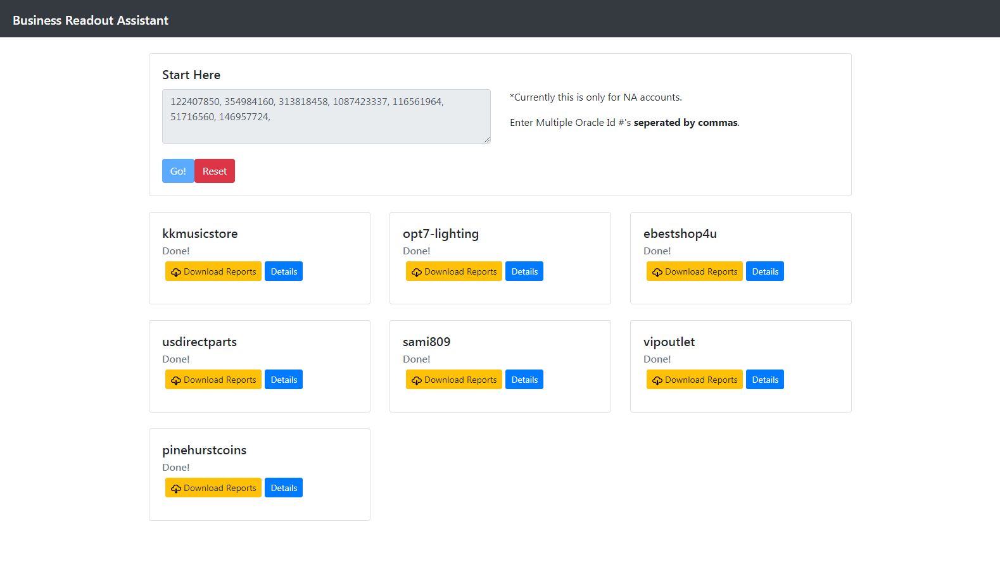

# One Pager Assistant

## Overview

The purpose of this application is to be able put the power of "Business Readout" creation in the hands of more eBay agents.

The "Business Readout" has some very good information for our members, however it is something that must be built manually which is very time consuming and labor intensive.

### Gallery

Home, getting started:

Multiple reports:

Several rows:

Downloads complete:

### Problem

Currently in order to build out a "Business Readout" it requires a lot of manual work, and our business needs many of them. Currently creating a readout from scratch takes about 15-25 minutes and is very labor intensive. You cannot just start the process and go to lunch.

eBay has a lot of events where we visit with sellers face to face and bringing a Business Readout is a great resource. However we are talking about 100 - 1000 customers and creating this many readouts can take a serious amount of time.

### Solution

My solution will automate a lot of the hard work and so creating a readout will be a breeze.

The way it works is you simply input the ID number of the customer and click go, it'll do the rest. It will do several calculations and send several requests to servers to gather the required information and put all of the data in one place for your retrieval.

## Tech and Features Used

| Feature | Summary |
|-|-|
| React JS | State management and dynamic layout. |
| ES6 Syntax | Generators and Async / Await functions were used to handle the asynchronous download queue. |
| Create/Consume API's | Created API calls on PHP server and consumed them on React front end page.  |
| PHP | PHP is used as a back-end technology for some API routes and to run SQL queries. |
| Cancelable API calls | The DataGatherer component has several API routes in sequence. This process can be canceled if a user clicks "Reset". The API calls are configured to truly cancel when this happens. |
| Axios | API calls  |
| Responsive Layout | A responsive layout has been built in as I am using Bootstrap 4.0. |
| Bootstrap 4.0 | Styled components and responsive layout. |

## How to use

Simply input ID's of members whose account you want to download info for. Separate ID's by commas for multiple requests. Click go and wait for data to be downloaded automatically.

## How it works

1. The main component (PullMultiple) contains an array of the user ID's from the users input.
2. That component has a generator function that iterates over the array and adds the ID #'s one by one to an array to be processed.
3. For every ID # in the array to be processed, a "DataGatherer" component is created.
4. This DataGatherer component fires off all of the api calls and renders the progress to the screen.
5. These API calls are called in an asynchronous fashion in order to reduce strain on the server handling the queries.
6. As the API calls are being made, links to the finished .csv files are being saved to state.
7. The download button downloads several links at once from the saved links in state.
8. When all API calls have finished for an ID, the next iterator of the generator function is fired and the next ID goes through it's gathering phase.
9. The reset button cancels all API calls and bring highest component back to empty.
